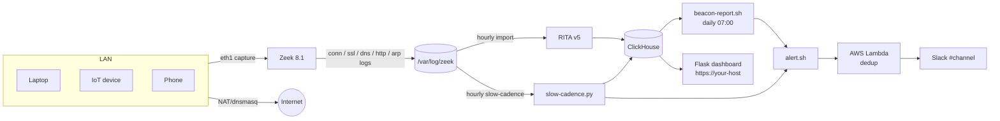

# BeaconButty

**A Raspberry Pi network appliance that catches malware command-and-control beacons on your LAN — by sitting in-line as the NAT router and analysing every flow with Zeek + RITA + ClickHouse.**

BeaconButty is a small DIY network detection device built around a Pi 5. It plugs in between your home or small-office switch and your existing internet router, becomes the LAN gateway, and continuously analyses outbound traffic for the periodic check-in patterns that distinguish C2 callbacks from normal browsing. When it finds one, it tells you on Slack and on a local web dashboard.

This repository is the full source: install scripts, systemd units, the Flask dashboard, the Zeek site policy, the RITA wrapper, the alert pipeline, and the docs needed to rebuild it from a fresh Pi.

> 📣 BeaconButty is the subject of a talk at **BSides UK 2026 (July)** — slides and recording links will be added here after the event.


---

## Why this exists

EDR catches malware on endpoints; firewalls block known-bad destinations; SIEMs ingest logs from systems that already know they're being attacked. The gap is the unmanaged corner of a small network — IoT devices, family-member laptops, anything that can't or won't run an agent — beaconing out to a CDN-fronted C2. There's nothing dramatic to alert on per-flow; the signal is *periodicity over hours or days*.

That's what RITA does well. BeaconButty is an opinionated packaging of Zeek + RITA + ClickHouse onto a single ~£420 box you can set up in an afternoon, plus a webapp that surfaces what RITA finds in a form a human can act on (with a fast false-positive workflow so it stays useful past the first day).

It is **not** a replacement for enterprise NDR. It's the thing you put on the small network nobody is monitoring.

---

## What it does

- **Beacon scoring** — RITA flags rhythmically-connecting destinations by entropy and dispersion across each daily Zeek dataset.
- **Slow-cadence detector** — a second-pass detector for low-rate beacons (≤6 connections/day for ≥5 days) that RITA's same-day analysis can miss.
- **JA4 TLS fingerprinting** — every TLS Client Hello fingerprinted on the wire, indexed per device, cross-referenced against [FoxIO's ja4db](https://github.com/FoxIO-LLC/ja4) for known-bad fingerprints.
- **Threat-intel enrichment** — bare external IPs cross-referenced against Shodan InternetDB, AbuseIPDB, Spamhaus DROP, and the Tor exit list (daily refresh).
- **Teams-relay anomaly detection** — spots the [DragonForce / Backdoor.Turn](docs/investigation/teams-relay-detection.md) C2-over-Teams-TURN pattern by combining JA4 anomaly, flow-duration outlier, and bandwidth-too-low signals against the live Microsoft Teams endpoint list.
- **L2 anomaly detection** — ARP-level gateway-impersonation alerts via a custom Zeek logger.
- **False-positive workflow** — point-and-click registry that suppresses by device MAC, destination domain/IP, or protocol, with apex-aware fnmatch and ASN-derived reason pre-fill.
- **Slack alerts** — per-detector enable/disable, structural gates to keep noise down (e.g. "lonely + non-hyperscaler"), and a Slack-channel clear button when you really do need to read every alert.
- **OLED status display** — front-of-rack 128×64 SSD1306 showing live beacon counts, uptime, and load.
- **Daily Slack digest, weekly archives, 14-day automatic backups, USB cloning** — operational pipeline is built in.

---

## Architecture



The Pi is **in-line** — not a SPAN/mirror tap — so it sees every packet without needing managed switch support. Capture happens on `eth1` (the LAN side); `eth0` is the WAN-facing interface. dnsmasq handles DHCP/DNS for the LAN, which means BeaconButty also gets clean hostname resolution for free.

Deeper writeups in [`docs/architecture/`](docs/architecture/) — start with [system-overview.md](docs/architecture/system-overview.md).

---

## Hardware

Total cost ~£420 (UK retail, mid-2026):

| Component | Why | Notes |
|---|---|---|
| Raspberry Pi 5 8GB (~£170) | ClickHouse + Zeek + RITA all in 8GB | 4GB works but is tight |
| Pironman 5 NVMe case (~£170) | Active cooling, NVMe slot, OLED, RGB fan | Tiered fan control script included |
| 1TB NVMe SSD (~£60) | Zeek logs + ClickHouse history; SSD endurance via log2ram | Any M.2 2280 fits |
| USB-C 2.5G Ethernet adapter (~£20) | Second NIC for WAN-side capture | Pi 5 only has one onboard |
| MicroSD 64GB (~£10) | Backup OS for rescue boot | Optional |

Full bill of materials and assembly notes: [`docs/hardware/hardware-setup.md`](docs/hardware/hardware-setup.md).

---

## Quick start

1. **Flash Raspberry Pi OS Lite (64-bit) Bookworm** to your NVMe. Set a hostname, your user, and your SSH key in Pi Imager's customisation step. The systemd units and backup scripts assume the default user is `dm` and the repo lives at `/home/dm/BeaconButty/` — if you pick a different username, run `grep -rl '/home/dm/' scripts/ systemd/ webapp/ | xargs sed -i "s|/home/dm|/home/$USER|g"` before the next step.

2. **Clone this repo on the Pi**:
    ```sh
    git clone https://github.com/mustard-research/BeaconButty.git
    cd BeaconButty
    ```

3. **Copy the site-local config template**:
    ```sh
    sudo mkdir -p /etc/beaconbutty
    sudo cp config/local.env.example /etc/beaconbutty/local.env
    sudoedit /etc/beaconbutty/local.env   # set BB_HOST, BB_LAN_GATEWAY_MAC, etc.
    ```
    The MAC is critical — `ip -o link show eth1 | awk '{print $17}'` gives you the right value.

4. **Run the install scripts in order**:
    ```sh
    sudo ./scripts/01_system_deps.sh
    sudo ./scripts/02_install_zeek.sh
    sudo ./scripts/03_install_clickhouse.sh
    sudo ./scripts/04_install_rita.sh
    sudo ./scripts/05_configure.sh
    sudo ./scripts/07_router_mode.sh     # turns the Pi into a NAT gateway — do this LAST
    sudo ./scripts/08_install_suricata.sh
    ```

5. **Plug the Pi inline** — `eth0` (or the USB NIC) to your internet router, `eth1` to your LAN switch. Reboot.

6. **Visit the dashboard** at `https://<your-host>/` (or `http://<lan-gateway-ip>:8080/` if you haven't set up TLS yet) and watch the first day of data come in.

The full deployment guide, including TLS via Let's Encrypt and Route 53 DNS, is in [`RESTORE.md`](RESTORE.md) (written as a disaster-recovery guide, which makes it the most rigorous install path too).

---

## Daily use

Each morning you'll see a Slack digest with the top beacon candidates from the previous day. The webapp has eight pages — the most-used ones:

- **Dashboard** — system tiles, today's beacon counts, fan state, log2ram fill, alert digest.
- **Beacons** — RITA hotlist with a sortable table, inline FP workflow, and per-row enrichment (JA4, ASN, threat intel).
- **Network** — top talkers, new beacons, exfil/night-activity panels, JA4 inventory.
- **Slow Beacons** — multi-day low-rate destinations RITA's daily window misses.
- **Health** — structured cards for every component, Slack "test alert" / "clear channel" buttons.


The detailed UI tour — including the full screenshot gallery for the eight pages — is in [`docs/development/webapp.md`](docs/development/webapp.md).

A handful of operational scripts on the Pi cover everything else — they live at `/usr/local/bin/beaconbutty-*.sh` and are documented in [`docs/development/scripts-and-timers.md`](docs/development/scripts-and-timers.md):

```sh
beaconbutty-summary.sh            # today's findings
beaconbutty-fp.sh list            # current FP registry
beaconbutty-fp.sh add <ip> "..."  # add an FP
beaconbutty-health.sh             # full system check
```

---

## Documentation

Everything else is under [`docs/`](docs/):

| | |
|---|---|
| [architecture/](docs/architecture/) | System design, services, data pipeline, alert chain |
| [hardware/](docs/hardware/) | Pi build, cooling, OLED |
| [operation/](docs/operation/) | Daily ops, health monitoring, backup, capacity, troubleshooting, reboot procedure |
| [security/](docs/security/) | Hardening — SSH, firewall, fail2ban, sudoers |
| [development/](docs/development/) | Webapp internals, full script/timer inventory, licensing |
| [investigation/](docs/investigation/) | False-positive workflow, alert tuning, slow-cadence detector design, IP enrichment, threat case studies |

---

## Status

**Stable and in active production use** on the original `bb0` since early 2026; ~150 commits of operational refinement since the initial Zeek+RITA wiring. The webapp, detectors, alert pipeline, backup tier, and health monitoring are all battle-tested against real traffic on a household network.

**Experimental / partial:**
- ClickHouse 26 — runs fine, but kept apt-marked hold to avoid silent config-dir wipes (see [troubleshooting](docs/operation/troubleshooting.md)).

---

## Licensing

BeaconButty's own code is **MIT licensed** (see [`LICENSE`](LICENSE)).

The JA4 fingerprint algorithm we use for the TLS Client Hello is **BSD-3** (FoxIO). However, JA4+'s extended fingerprints (JA4S/JA4H/JA4X/etc.) are licensed under FoxIO License 1.1 — *non-commercial use only*. BeaconButty as packaged here is fine for personal/internal use. If you want to use the JA4+ extensions in a commercial product, you need a separate OEM licence from FoxIO. See [`docs/development/licensing.md`](docs/development/licensing.md) for the full analysis.

Third-party tools used (RITA, Zeek, ClickHouse, Suricata, dnsmasq) each carry their own licences and are installed from their own package repositories.

---

## Contributing

Issues and PRs welcome. The repo is the project's full history; CI is intentionally minimal because BeaconButty is a deployed system, not a library — verification happens on real traffic.

If you're rebuilding this on your own Pi and hit something the docs don't cover, please open an issue — the answer is probably worth being in the docs.

---

## Talks & writing

- **BSides UK 2026** (July) — *Building a household network beacon detector with Zeek, RITA, and a Raspberry Pi*. Slides + recording link to follow.

---

Built by [Mustard Research](https://mustardresearch.com).
